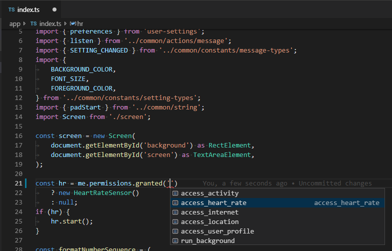
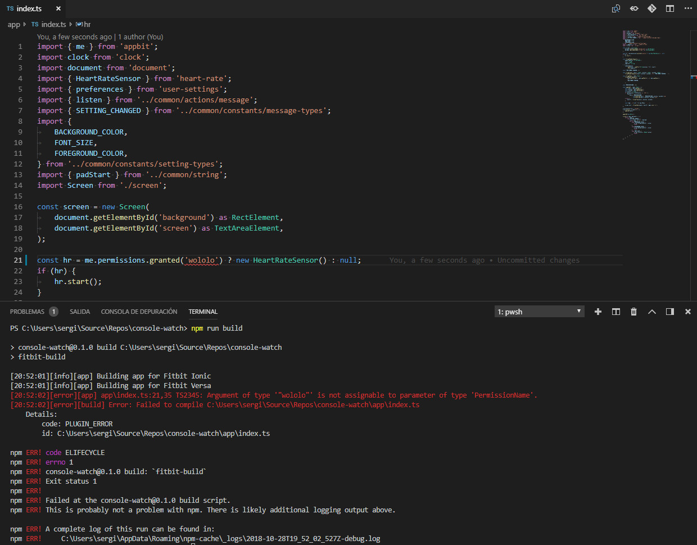

# Fitbit SDK Types ✔

[](https://badge.fury.io/js/fitbit-sdk-types)
[](https://travis-ci.com/SergioMorchon/fitbit-sdk-types)

Add types to your Fitbit CLI project and work safely with TypeScript preventing you of doing stupid mistakes.

## ⚙ How to use in your app project

### ✨ Automatic configuration

1. First, create your Fitbit CLI project following the official instructions at https://dev.fitbit.com/build/guides/command-line-interface/.
2. Then, from that project root, run `npx fitbit-sdk-types apply` to apply TypeScript to your existing Fitbir project.
3. Profit!

This is a shortand script that performs step by step the same actions described below.

### ✍ Manual configuration

1. Execute `npm install --save-dev fitbit-sdk-types` to add this type definitions.
2. `include` them in your project's `tsconfig.json` file. It may look like this **tsconfig.json**:

```json
{
	"extends": "./node_modules/@fitbit/sdk/sdk-tsconfig.json",
	"include": ["node_modules/fitbit-sdk-types", "**/*.ts", "**/*.tsx"]
}
```

3. Rename your files from `.js` to `.ts` and use it. For example, **app/index.ts**:

```typescript
import { Accelerometer } from 'accelerometer';

const acc = new Accelerometer();
console.log(acc.activated);
console.log(acc.potato); // error
```

#### Strict configuration

Add the following configurations for each target.

#### app/tsconfig.json

```json
{
	"extends": "../tsconfig.json",
	"include": ["../node_modules/fitbit-sdk-types/types/device.d.ts", "**/*.ts"]
}
```

#### companion/tsconfig.json

```json
{
	"extends": "../tsconfig.json",
	"include": [
		"../node_modules/fitbit-sdk-types/types/companion.d.ts",
		"**/*.ts"
	]
}
```

#### settings/tsconfig.json

```json
{
	"extends": "../tsconfig.json",
	"include": [
		"../node_modules/fitbit-sdk-types/types/settings.d.ts",
		"**/*.tsx"
	]
}
```

## Benefits of using types

### Discoverability

Know what is available to build your ideas right from your code.

**Enumerated and strict string literals**



**Also in JSX for settings**


### Integrated with the Fitbit CLI build process

It is fully integrated within the Fitbit CLI build process that _already_ uses TypeScript. With this approach you are just _extending_ its knowledge about what can you use and how.

So if your code is not ok, then it won't build. That way it will prevent you from wasting a lot of time with typos, undefined functions and trivial bugs, letting you focus on what really matters.

**Code error, so the build process fails**


## Examples

You can see a ton of official examples working as tests right here, under the `./test` path.

## Gotchas

- 🧐 **To have a _full type experience_**: add the `strict` mode to your **tsconfig.json**:

```json
{
	"compilerOptions": {
		"strict": true
	}
}
```

## Contributing

### ❗ Open an issue

If you have a question, suggestion or bug report, don't be shy and open an issue 🎈.

### 💪 Make a PR with:

1. The use cases you think that must be covered, under a meaningful section inside **test-code-samples/**.
1. The type definition in the appropiate **types/** file.
1. If possible, a link to the official documentation or community forum thread.
